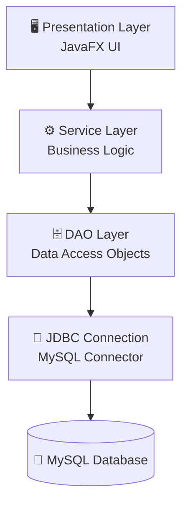

# 🎨 ArtConnect - Local Art Community Platform


## 📌 Project Overview
**ArtConnect** is a comprehensive desktop application designed to bridge the gap between local creators (Artists), spaces (Galleries), and art enthusiasts (Community Members). It provides a centralized hub to discover artworks, manage artist portfolios, and book educational workshops.

This project was developed as a comprehensive academic assignment focusing on strict **relational database design (3NF)**, **Advanced SQL programming**, and **Java Application Architecture**.

---

## 🏗 Architecture & Technologies
The application is built using a strict **3-Tier Architecture**, ensuring a clean separation of concerns and robust scalability:



### 🔹 1. Presentation Layer (JavaFX)
Provides an intuitive graphical user interface with dynamically loaded `TableView` components, searching capabilities, and fully integrated **CRUD forms** for real-time database management.

### 🔹 2. Business Logic Layer (Services)
Acts as the intermediary, validating rules before communicating with the database. Services are implemented as singletons via `ServiceProvider`.

### 🔹 3. Persistence Layer (JDBC DAOs)
Translates object-oriented operations into secure SQL `PreparedStatement` queries.

---

## 🗄 Database Design & Advanced SQL
The backend is powered by a robust MySQL database optimized for performance and data integrity.

- **Strict Normalization**: The Conceptual and Logical Data Models adhere strictly to the **3rd Normal Form (3NF)**.
- **Triggers**: Includes automation, such as the `after_artist_insert` trigger which automatically assigns a default discipline to new artists.
- **Stored Procedures**: Features `search_artworks`, shifting complex filtering logic directly to the database server.
- **Views**: The `artist_portfolio` view provides pre-joined, optimized datasets for reporting.
- **Transactions**: Used for sensitive operations like workshop bookings to ensure atomicity and prevent data corruption.

---

## 🚀 Key Features
- **Dynamic Artist Directory**: Browse, add, update, and remove artists with real-time UI synchronization.
- **Artwork Discovery**: Filter and search through an extensive catalog of artworks.
- **Exhibition & Gallery Tracking**: Track physical events and locations.
- **Community Bookings**: Secure booking system for local workshops.

---

## 🛠 Getting Started

### Prerequisites
- **Java 17** or higher
- **Maven**
- **MySQL Server 8.0+**

### Database Setup
1. Open your MySQL client and run the scripts located in the `/sql` directory in order:
   - `01_schema.sql`
   - `02_data_seeding.sql`
   - `03_views_indexes.sql`
   - `04_triggers_procedures.sql`
   - `05_transactions.sql`
2. Update the database credentials in `src/main/java/com/project/artconnect/config/DatabaseConfig.java` to match your local setup.

### Running the Application
Open a terminal in the `ArtConnectPro-App` directory and run:
```bash
mvn clean javafx:run
```

---
*Developed as a Final Academic Project demonstrating expertise in Database Design, Advanced SQL, and Object-Oriented Application Development.*
